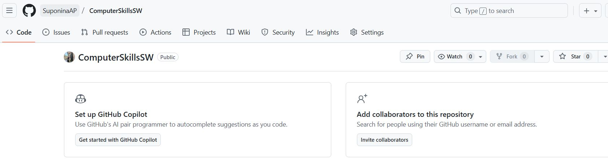
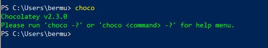
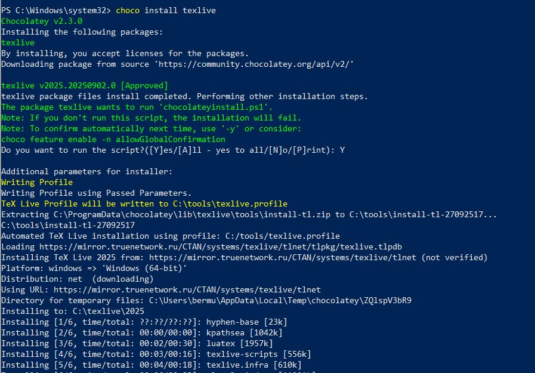
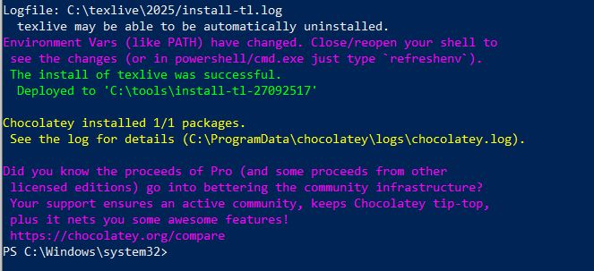
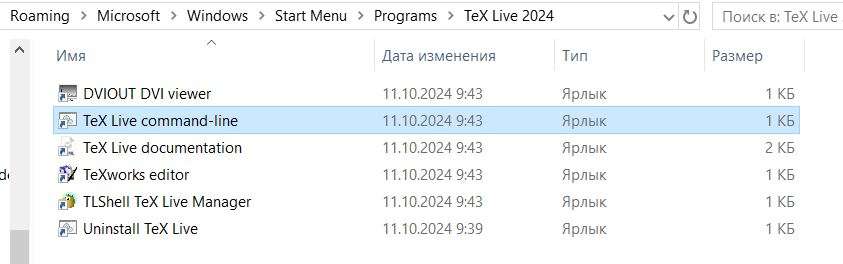
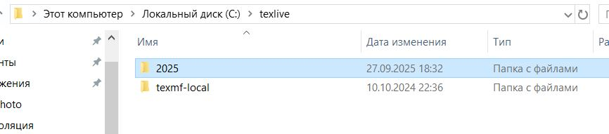
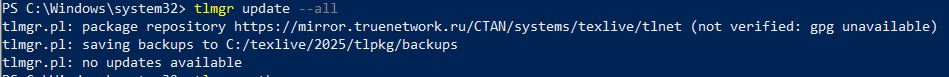
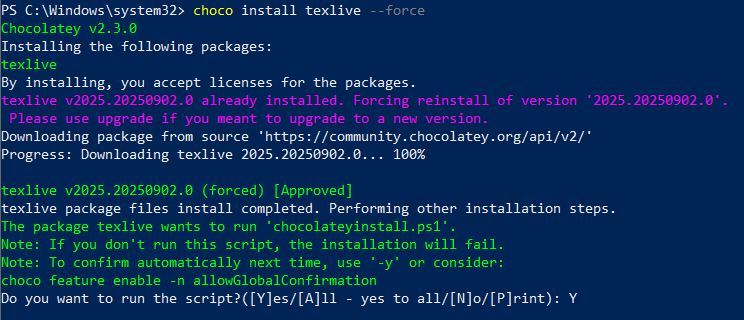
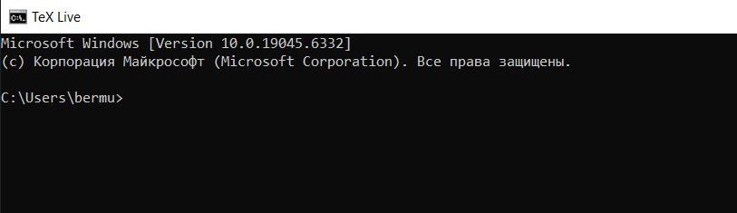

---
## Front matter
lang: ru-RU
title: Практикум по научному письму
author: Роман Сергей Михайлович
institute: РУДН, Москва, Россия

date: 27 Сентября 2025

## Formatting
## i18n babel
babel-lang: russian
babel-otherlangs: english

## Formatting pdf
toc: false
toc-title: Содержание
slide_level: 2
aspectratio: 169
section-titles: true
theme: metropolis
header-includes:
 - \metroset{progressbar=frametitle,sectionpage=progressbar,numbering=fraction}
---

# Лабораторная работа 1

## Цель работы

Установить программу Tex Live.

**Задание**

Используя ранее установленный Chocolatey установить texlive.

## Generalinformation

    TeXLive — самый полный дистрибутив LaTeX, поддерживаемый сообществом TEXS. Поддерживает большое количество операционных систем.
    
    Разрабатывается с 1996 года.
    
    Основан на дистрибутиве teTeX.
    
    MacTeX—это альтернативный форматный каталог.
    
    Главная страница: https://www.tug.org/texlive/.
    
    TeXLive — это дистрибутив с постоянными обновлениями в рамках ежегодной версии дистрибутива.

## Создание нового репозитория на GitHub.

Создаю новый репозиторий на портале GitHub, для дальнейшей работы и загружаю его через VScode. Ссылка на профиль https://github.com/SuponinaAP/ScientificProg

{#fig:002 width=50%}

## Проверка наличия Chocolate.

Проверяю через Windows PowerShell установлен ли у меня Chocolate

Вижу, что данная программа уже установлена и имеет версию 2.3.0
Тогда при поомощи этой программы я могу выполнить следующий и основной шаг.

## Установка texlive

Важно! Чтобы установка успешно началась необходимо запустить Windows PowerShell через **Администратора**

{#fig:002 width=50%}

{#fig:002 width=50%}

## Расположение в папках

{#fig:002 width=50%}

{#fig:002 width=50%}

## Проверка наличия обновлений для установленной версии

## Переустановка при повреждении файлов

## Запуск

После этого я могу сказать, что задание данной работы было выполнено.

## Выводы

В процессе выполнения данной лабораторной работы я научилась устанавливать программу texlive на компьютер с операционной системой Windows. Узнала о новых для себя функциях существующих в Windows PowerShell и на ошибках разобралась с тем где располагаются функциональные файлы этой программы и как правильно определить является ли установленная версия последней. 

## {.standout}

Спасибо за внимание!
