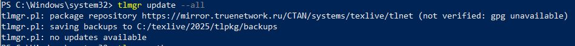

---
## Front matter
title: "Отчёт по лабораторной работе 1"
author: "Супонина Анастасия Павловна"

## Generic otions
lang: ru-RU
toc-title: "Содержание"

## Bibliography
bibliography: bib/cite.bib
csl: pandoc/csl/gost-r-7-0-5-2008-numeric.csl

## Pdf output format
toc: true # Table of contents
toc-depth: 2
lof: true # List of figures
lot: true # List of tables
fontsize: 12pt
linestretch: 1.5
papersize: a4
documentclass: scrreprt
## I18n polyglossia
polyglossia-lang:
  name: russian
  options:
  - spelling=modern
  - babelshorthands=true
polyglossia-otherlangs:
  name: english
## I18n babel
babel-lang: russian
babel-otherlangs: english
## Fonts
mainfont: IBM Plex Serif
romanfont: IBM Plex Serif
sansfont: IBM Plex Sans
monofont: IBM Plex Mono
mathfont: STIX Two Math
mainfontoptions: Ligatures=Common,Ligatures=TeX,Scale=0.94
romanfontoptions: Ligatures=Common,Ligatures=TeX,Scale=0.94
sansfontoptions: Ligatures=Common,Ligatures=TeX,Scale=MatchLowercase,Scale=0.94
monofontoptions: Scale=MatchLowercase,Scale=0.94,FakeStretch=0.9
mathfontoptions:
## Biblatex
biblatex: true
biblio-style: "gost-numeric"
biblatexoptions:
  - parentracker=true
  - backend=biber
  - hyperref=auto
  - language=auto
  - autolang=other*
  - citestyle=gost-numeric
## Pandoc-crossref LaTeX customization
figureTitle: "Рис."
tableTitle: "Таблица"
listingTitle: "Листинг"
lofTitle: "Список иллюстраций"
lotTitle: "Список таблиц"
lolTitle: "Листинги"
## Misc options
indent: true
header-includes:
  - \usepackage{indentfirst}
  - \usepackage{float} # keep figures where there are in the text
  - \floatplacement{figure}{H} # keep figures where there are in the text
---

# Цель работы

Установить программу Tex Live.

# Задание

Используя ранее установленный Chocolatey установить texlive.

# Теоретическое введение

## Generalinformation

    TeXLive — самый полный дистрибутив LaTeX, поддерживаемый сообществом TEXS. Поддерживает большое количество операционных систем.
    
    Разрабатывается с 1996 года.
    
    Основан на дистрибутиве teTeX.
    
    MacTeX—это альтернативный форматный каталог.
    
    Главная страница: https://www.tug.org/texlive/.
    
    TeXLive — это дистрибутив с постоянными обновлениями в рамках ежегодной версии дистрибутива.

# Выполнение лабораторной работы

## Создание нового репозитория на GitHub.

Создаю новый репозиторий на портале GitHub, для дальнейшей работы и загружаю его через VScode. Ссылка на профиль https://github.com/SuponinaAP/ScientificProg

{#fig:002 width=50%}

## Проверка наличия Chocolate.

Проверяю через Windows PowerShell установлен ли у меня Chocolate

Вижу, что данная программа уже установлена и имеет версию 2.3.0
Тогда при поомощи этой программы я могу выполнить следующий и основной шаг.

## Установка texlive

Ввожу команду указанную в руководстве для установки texlive и даю своё согласие на установку.

Важно! Чтобы установка успешно началась необходимо запустить Windows PowerShell через **Администратора**

Спустя некоторое время данная программа устанавливается и в конце мы получаем сообщение об успешной установке:

Также мы можем увидеть её в проводнике в следующих папках которые отображены на фотографиях ниже 

и

При установке название в основной папке стоит с годом 2024, поэтому я начала думать о том, что данная версия не является последней и отталкиваясь от указаний решила вручную её обновить. Также в документах указанных ниже было две папки 24 и 25 года.

Важно заметить, что при изменении версии мы работаем с основными файлами и вначале я допустила ошибку взяв не тот путь папок

Зато я узнала, что если в названии папки содержаться пробелы, то для корректной работы необходимо перед ними ставить знак **`**.

Правильные папки для работы указаны во втором скриншоте, а именно C:\texlive\2025.

К сожалению действия указанные в методичке в моей случае оказались не применимы и я получала только ошибки, поэтому я решила проверить существует ли какое-то обновления использую следующую команду на изображении ниже

И тут наглядно увидела, что никаких новых версий нет, но так как уже много изменений было произведено, программа отказывалась работать корректно и тогда при помощи подсказок от Windows PowerShell я ввела нужную комманду для переустановки последней версии Texlive.

После того, как я переустановила данную программу я ещё раз проверила, существуют ли обновления, но таковых не было и запустила её, чтобы удостовериться, что всё работает.

После этого я могу сказать, что задание данной работы было выполнено.

# Выводы

В процессе выполнения данной лабораторной работы я научилась устанавливать программу texlive на компьютер с операционной системой Windows. Узнала о новых для себя функциях существующих в Windows PowerShell и на ошибках разобралась с тем где располагаются функциональные файлы этой программы и как правильно определить является ли установленная версия последней. 

# Список литературы{.unnumbered}

::: Пособие по лабораторным работам {https://esystem.rudn.ru/pluginfile.php/2862317/mod_folder/content/0/Practical-scientific-writing.pdf}

[def]: СSlab1photo/repsave.JPG