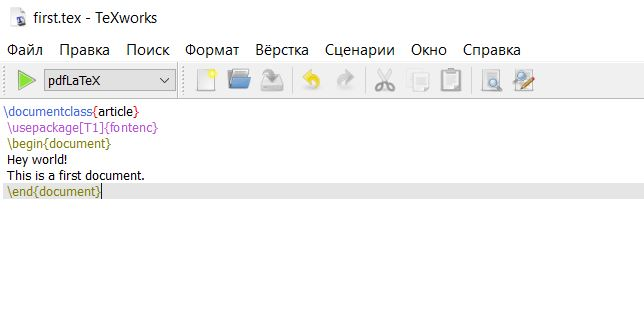
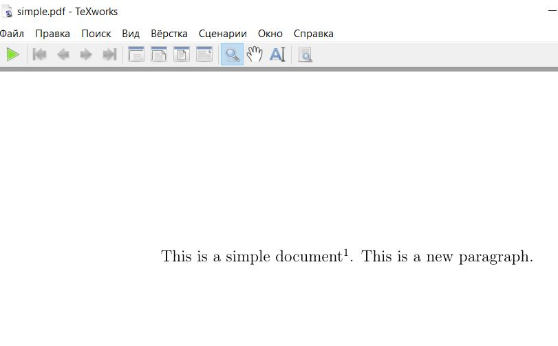

---
## Front matter
lang: ru-RU
title: Лабораторная работа 2
author: Супонина Анастасия Павловна
institute: РУДН, Москва, Россия

date: 27 Сентября 2025

## Formatting
## i18n babel
babel-lang: russian
babel-otherlangs: english

## Formatting pdf
toc: false
toc-title: Содержание
slide_level: 2
aspectratio: 169
section-titles: true
theme: metropolis
header-includes:
 - \metroset{progressbar=frametitle,sectionpage=progressbar,numbering=fraction}
---

# Лабораторная работа 1

## Цель работы

Изучить структуру документа LaTeX.

**Задание**

Создать несколько файлов в LaTex и в процессе изучить их структуру.

## Теоретическое введение

Каждый документ начинается с описания класса.
Также необходимо указать пакеты, которые будут использоваться при компиляции и только после этого мы используем \begin и \end между которыми будет находиться основное содержимое нашего документа.

# Выполнение лабораторной работы

## Создание самого первого файла

## Запуск самого первого файла

А также пробую запустить файл через консоль: 

## Полученный файл с пдф отображением

## Простой файл с комментариями

После создания первого файла, также использую шаблон создаю другой файл с названием simple

## Простой файл с комментариями вывод результата

## Создание собственного документа и изучение функций

## Выводы

В процессе выполнения данной лабораторной работы я изучила стандартный вид документа в LaTeX. Создала несколько первых программ, для понимания структуры документа. Научилась создавать документ умеющий работать с русским языком, а также изучила множество функций связанных с правильным оформлением текста, таких как разные типы пробелов, ввод специальных символов и т.д. 

## {.standout}

Спасибо за внимание!
