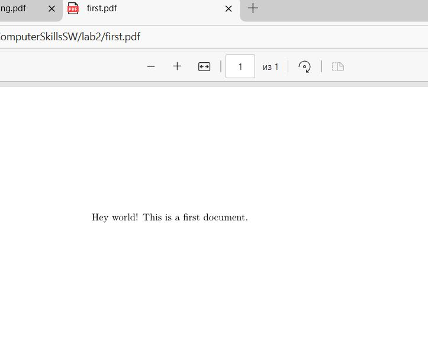

---
## Front matter
title: "Отчёт по лабораторной работе 2"
author: "Супонина Анастасия Павловна"

## Generic otions
lang: ru-RU
toc-title: "Содержание"

## Bibliography
bibliography: bib/cite.bib
csl: pandoc/csl/gost-r-7-0-5-2008-numeric.csl

## Pdf output format
toc: true # Table of contents
toc-depth: 2
lof: true # List of figures
lot: true # List of tables
fontsize: 12pt
linestretch: 1.5
papersize: a4
documentclass: scrreprt
## I18n polyglossia
polyglossia-lang:
  name: russian
  options:
  - spelling=modern
  - babelshorthands=true
polyglossia-otherlangs:
  name: english
## I18n babel
babel-lang: russian
babel-otherlangs: english
## Fonts
mainfont: IBM Plex Serif
romanfont: IBM Plex Serif
sansfont: IBM Plex Sans
monofont: IBM Plex Mono
mathfont: STIX Two Math
mainfontoptions: Ligatures=Common,Ligatures=TeX,Scale=0.94
romanfontoptions: Ligatures=Common,Ligatures=TeX,Scale=0.94
sansfontoptions: Ligatures=Common,Ligatures=TeX,Scale=MatchLowercase,Scale=0.94
monofontoptions: Scale=MatchLowercase,Scale=0.94,FakeStretch=0.9
mathfontoptions:
## Biblatex
biblatex: true
biblio-style: "gost-numeric"
biblatexoptions:
  - parentracker=true
  - backend=biber
  - hyperref=auto
  - language=auto
  - autolang=other*
  - citestyle=gost-numeric
## Pandoc-crossref LaTeX customization
figureTitle: "Рис."
tableTitle: "Таблица"
listingTitle: "Листинг"
lofTitle: "Список иллюстраций"
lotTitle: "Список таблиц"
lolTitle: "Листинги"
## Misc options
indent: true
header-includes:
  - \usepackage{indentfirst}
  - \usepackage{float} # keep figures where there are in the text
  - \floatplacement{figure}{H} # keep figures where there are in the text
---

# Цель работы

Изучить структуру документа LaTeX.

# Задание

Создать несколько файлов в LaTex и в процессе изучить их структуру.

# Теоретическое введение

Основные моменты.

Каждый документ начинается с описания класса.
Также необходимо указать пакеты, которые будут использоваться при компиляции и только после этого мы используем \begin и \end между которыми будет находиться основное содержимое нашего документа.

# Выполнение лабораторной работы

## Создание самого первого файла

Для того, чтобы начать создавать файл открываю папку с LaTeX и запускаю editor

Используя данны1 в пособии шаблон создаю свой первый файл

Запускаю его через саму программу:

А также пробую запустить файл через консоль: 

Также захожу в папку в которую сохранила его до запуска, чтобы посмотреть, что именно сохранилось

И отсюда запускаю pdf версию

## Простой файл с комментариями

После создания первого файла, также использую шаблон создаю другой файл с названием simple

На изображении выше мы видим, что в отличии от первого файла, здесь у нас указан формат листа, а именно А4 и присутствуют комментарии, которых в самом файле уже не будет, также есть сноска, которую наглядно видно на фотографии ниже, на которой представлени результат полученный при запуске итогового pdf файла

## Создание собственного документа и изучение функций

Упражнение:
Попробуйте добавить текст в свой первый документ, наберите текст и посмотрите изменения в PDF. Сделайте несколько разных абзацев и добавьте переменные пробелы. Узнайте, как работает ваш редактор; щелкните исходный код и узнайте, как перейти к той же строке в вашем PDF-файле. Попробуйте добавить несколько жестких пробелов и посмотрите, как они влияют на разбиение строк.

Изначально хочу сказать о том, что в начале документа я добавила специальные пакеты, для того, чтобы программа могла работать с русским языком.

На скрине ниже представлен текст программы рядом с результатом(для наглядности)

При написанниии этой программы я выполнила все задания указанные выше, мы можем видеть несколько абзацев, неразрываные пробелы, длинные пробелы, а также даже перенос строк.

# Выводы

В процессе выполнения данной лабораторной работы я изучила стандартный вид документа в LaTeX. Создала несколько первых программ, для понимания структуры документа. Научилась создавать документ умеющий работать с русским языком, а также изучила множество функций связанных с правильным оформлением текста, таких как разные типы пробелов, ввод специальных символов и т.д. 

# Список литературы{.unnumbered}

::: Пособие по лабораторным работам {https://esystem.rudn.ru/pluginfile.php/2862317/mod_folder/content/0/Practical-scientific-writing.pdf}

[def]: СSlab1photo/repsave.JPG