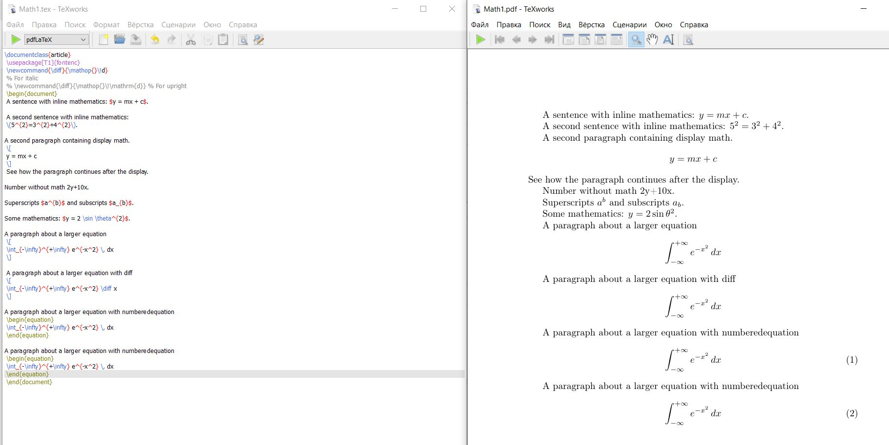
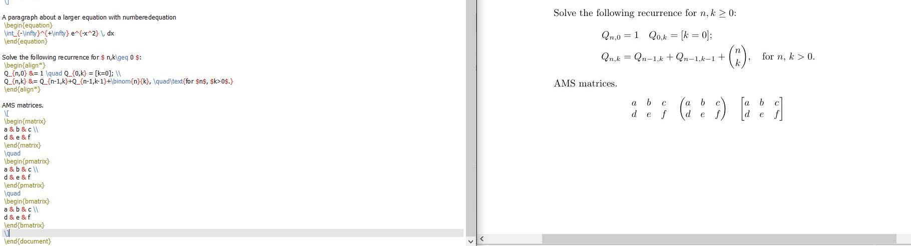
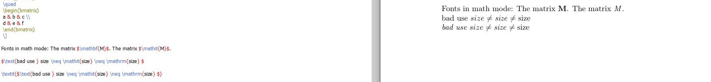
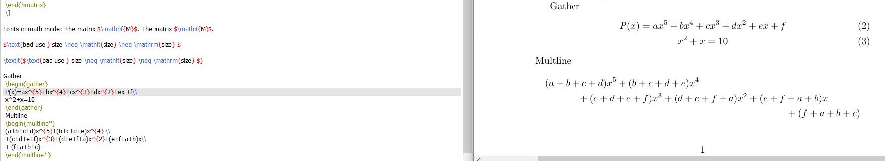
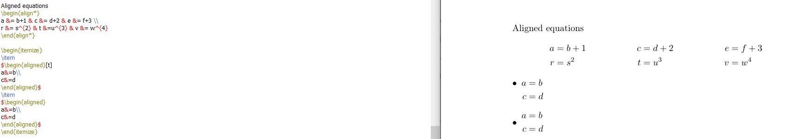
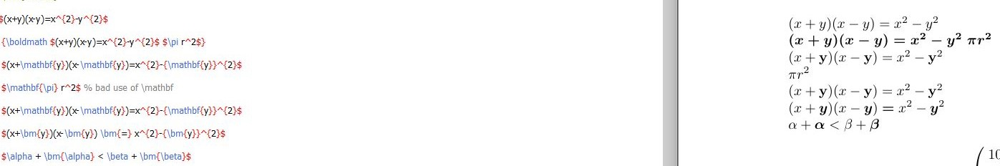

---
## Front matter
lang: ru-RU
title: Лабораторная работа 3
author: Супонина Анастасия Павловна 
institute: РУДН, Москва, Россия

date: 27 Сентября 2025

## Formatting
## i18n babel
babel-lang: russian
babel-otherlangs: english

## Formatting pdf
toc: false
toc-title: Содержание
slide_level: 2
aspectratio: 169
section-titles: true
theme: metropolis
header-includes:
 - \metroset{progressbar=frametitle,sectionpage=progressbar,numbering=fraction}
---

# Лабораторная работа 3

## Цель работы

Изучить ввод математических действий в LaTex.

## Задание

Изучить способы ввода математических операций в среде LaTex и также изучить пакеты, которые расширяют возможности ввода математических операций.

## Пакеты

1) amsmath - пакет, который добавляет расширенные возможности для записи математических 
2) mathtools - пакет, который имеет более расширенные amsmath, но более он направлен на матрицы
3) bm - пакет, при помощи выделяется текст жирным шрифтом
4) \{\diff\}\{\mathhop\{\}\!d\} - комманда, которая при записи дифференциального уравнения преобразует знак "d" в единый формат записи

{#fig:002 width=50%}

## Математический режим

Без использования дополнительных пакетов, нам доступны следующие функции:

{#fig:002 width=50%}

## Пакет amsmath

amsmath - пакет, который добавляет расширенные возможности для записи математических 

{#fig:002 width=50%}

## Шрифты

- \mathrm: римский (вертикально)
- \mathit: выделенный курсивом как "текст"
- \mathbf: выделенный жирным шрифтом 
- \mathsf: без засечек
- \mathtt: моноширинный (пишущая машинка)
- \mathbb: с двойным ударением (выделено жирным шрифтом на доске) (предоставляется amsfonts pack возраст)

{#fig:002 width=50%}

## Выравнивания в amsmath

{#fig:002 width=50%}

{#fig:002 width=50%}

## Математика жирным шрифтом  

bm - пакет, при помощи выделяется текст жирным шрифтом

{#fig:002 width=50%}

## Пакет mathtools

mathtools - пакет, который имеет более расширенные возможночти чем amsmath, но более он направлен на матрицы

{#fig:002 width=50%}

## Unicode математика

{#fig:002 width=50%}

## Выводы

В процессе выполнения данной лабораторной работы я научилась записывать различные математические выражения в среде LaTex, изменять шрифты, выделять жирным шрифтом необходимые обозначения, нумеровать уравнения и выравнивать их относительно друг друга и относительно документа. 

## {.standout}

Спасибо за внимание!
