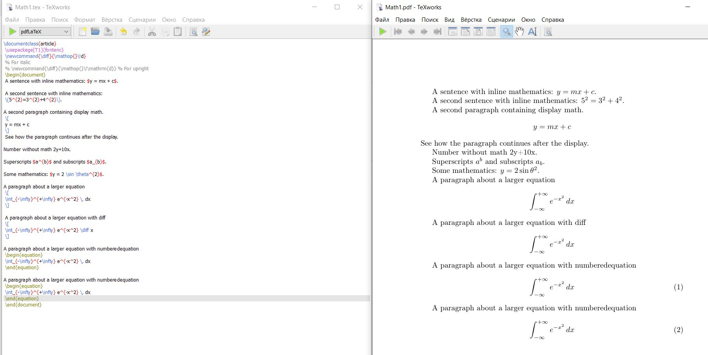
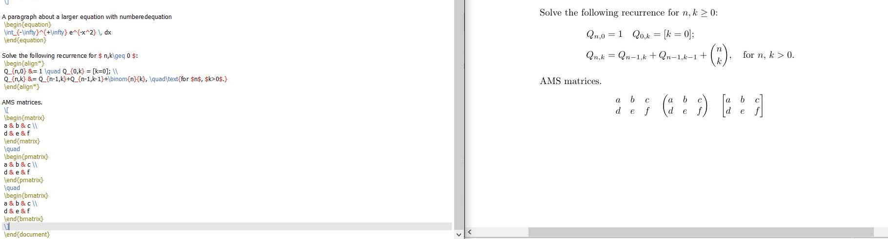
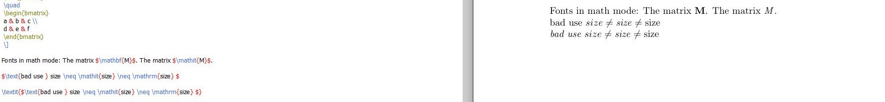
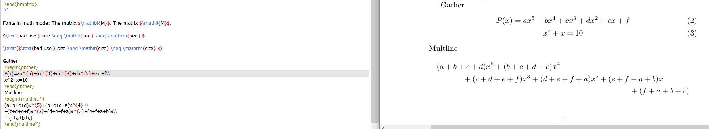
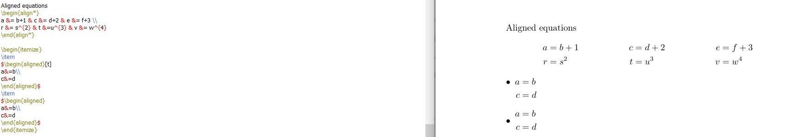
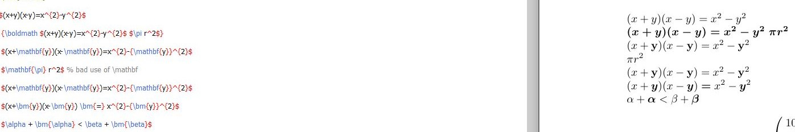
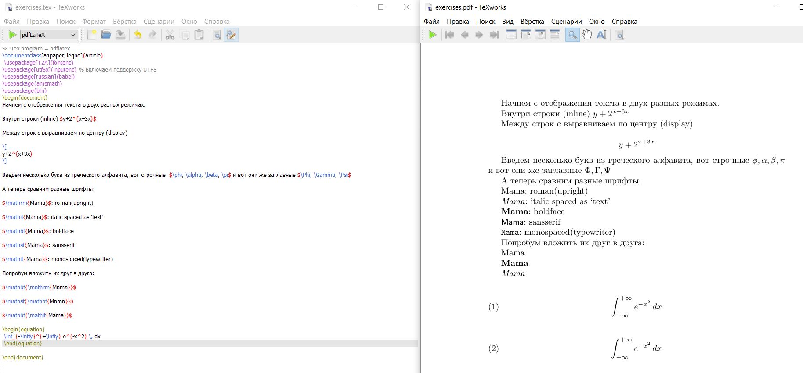

---
## Front matter
title: "Отчёт по лабораторной работе 3"
author: "Супонина Анастасия Павловна"

## Generic otions
lang: ru-RU
toc-title: "Содержание"

## Bibliography
bibliography: bib/cite.bib
csl: pandoc/csl/gost-r-7-0-5-2008-numeric.csl

## Pdf output format
toc: true # Table of contents
toc-depth: 2
lof: true # List of figures
lot: true # List of tables
fontsize: 12pt
linestretch: 1.5
papersize: a4
documentclass: scrreprt
## I18n polyglossia
polyglossia-lang:
  name: russian
  options:
  - spelling=modern
  - babelshorthands=true
polyglossia-otherlangs:
  name: english
## I18n babel
babel-lang: russian
babel-otherlangs: english
## Fonts
mainfont: IBM Plex Serif
romanfont: IBM Plex Serif
sansfont: IBM Plex Sans
monofont: IBM Plex Mono
mathfont: STIX Two Math
mainfontoptions: Ligatures=Common,Ligatures=TeX,Scale=0.94
romanfontoptions: Ligatures=Common,Ligatures=TeX,Scale=0.94
sansfontoptions: Ligatures=Common,Ligatures=TeX,Scale=MatchLowercase,Scale=0.94
monofontoptions: Scale=MatchLowercase,Scale=0.94,FakeStretch=0.9
mathfontoptions:
## Biblatex
biblatex: true
biblio-style: "gost-numeric"
biblatexoptions:
  - parentracker=true
  - backend=biber
  - hyperref=auto
  - language=auto
  - autolang=other*
  - citestyle=gost-numeric
## Pandoc-crossref LaTeX customization
figureTitle: "Рис."
tableTitle: "Таблица"
listingTitle: "Листинг"
lofTitle: "Список иллюстраций"
lotTitle: "Список таблиц"
lolTitle: "Листинги"
## Misc options
indent: true
header-includes:
  - \usepackage{indentfirst}
  - \usepackage{float} # keep figures where there are in the text
  - \floatplacement{figure}{H} # keep figures where there are in the text
---

# Цель работы

Изучить ввод математических действий в LaTex.

# Задание

зучить способы ввода математических операций в среде LaTex и также изучить пакеты, которые расширяют возможности ввода математических операций.

# Теоретическое введение

LaTex позволяет записывать математические выражения без установки дополнительных пакетов, а также имеет мноество встроенных функций для изменения формата вводимого текста. Однако существуют пакеты, которые расширяют изначальные возможности, а также некоторые комманды одна из которых будет рассмотрена в этой лабораторной работе.

1) amsmath - пакет, который добавляет расширенные возможности для записи математических 
2) mathtools - пакет, который имеет более расширенные возможночти чем amsmath, но более он направлен на матрицы
3) bm - пакет, при помощи выделяется текст жирным шрифтом
4) \{\\diff\}\{\\mathhop\{\}\\\!d\} - комманда, которая при записи дифференциального уравнения преобразует знак "d" в единый формат записи

{#fig:002 width=50%}

# Выполнение лабораторной работы

## Математический режим

На изображении представленном ниже отображаются два способа для записи уравнения.

Способ первый это запись внутри строки она реализуется при помощи знаков $.

Способ второй при помощи скобок \\\[ \\\], при таком способе уравнение записывается между строк и по стандарту имеет выравнивание по центру.
Ниже представлен способ для записи верхнего и нижнего индекса с использованием ^ и _ соответственно.

Далее представлено, что в LaTex есть специальные способы записи различных функций или латинских символов, при помощи обратного слеша.

Далее мы добавляем команду для одинакового отображения знака "d", описанную ранее и тогда на выводе мы видим, что вне зависимости от разного написания результат вывода у нас одинаков.

И завершающей частью изображения ниже является отображения способа автоматической нумерации уравнений в LaTex. Для этого мы записываем наше уравнение между begin\{equation\} и end\{equation\}.

{#fig:002 width=50%}

## Пакет amsmath

О том, что делает пакет ansmath было общими словами сказано ранее, теперь рассмотрим некоторые из его функций.

Первая из функций показанная на изображении ниже, это возможность выравнивать уравнения при помощи знака &.

Второй функцией же является отображения разного типа матриц, без скобок(**matrix**), с круглыми скобками(**pmatrix**) и с квадратными скобками(**bmatrix**).

{#fig:002 width=50%}

## Шрифты

Существует несколько различных функций для того, чтобы задать определенный шрифт в LaTex:

- \\mathrm: римский (вертикально)
- \\mathit: выделенный курсивом как "текст"
- \\mathbf: выделенный жирным шрифтом 
- \\mathsf: без засечек
- \\mathtt: моноширинный (пишущая машинка)
- \\mathbb: с двойным ударением (выделено жирным шрифтом на доске) (предоставляется amsfonts pack возраст)

На изображении ниже представлен способ использования шрифтов, также на нём можно наглядно посмотреть на их отличия.

Когда нужно вставить слово, которое является частью внешней структуры предложения и нуждается в текущем шрифте текста используем \\text\{...\} (который предоставляется пакетом amsmath) или определенными стилями шрифтов, такими как \\textrm\{..\}.

{#fig:002 width=50%}

## Выравнивания в amsmath

Если нам нужно записать несколько уравнений друг за другом, но с разной нумерацией используем **gather**.

Если же мы имеем дело с длинным уравнением на несколько строк, то да его корректной записи используем **multline**.

{#fig:002 width=50%}

Для записи уравнений в ровные столбцы также как и было рассказано используем знак &, а чтобы они все были выровнены пишем begin\{aligh*\} и end\{aligh*\}. 

\!Важно, что данная запись не будет нумероваться.

Также можно на изображении видеть альтернативные способы использования данного выравнивая.

{#fig:002 width=50%}

## Математика жирным шрифтом  

Если нам нужно выделить все уравнение жирным шрифтом мы можем использовать для этого \\boldmath.

Однако если мы хоти выделить только какой-то определенный элемент, то данный способ нам уже не подходит. Тогда существует два варианта для решения этой проблемы:

1) Используем из ранее упомянутых шрифтов \\mathbf

2) Использовать \\bm

Второй способ является, более комфортным из-за короткой записи, однако важно помнить, что для его использования необходимо установить специальны пакет **bm**.

Все эти способы отображены на изображении ниже.

{#fig:002 width=50%}

## Пакет mathtools

Ранее уже было сказано об этом пакете, тут мы рассмотрим одно из его возможных применений, ниже на изображении показан способ отображения и записи матрицы с использование mathtools.

{#fig:002 width=50%}

## Unicode математика

В этом разделе продемонстрировано использование пакета `unicode-math` с движком LuaLaTeX для работы с OpenType-шрифтами:

* Подключается пакет unicode-math, который позволяет использовать современные математические шрифты.
* Команды \\setmainfont и \\setmathfont задают основной и математический шрифты документа.

{#fig:002 width=50%}

## Упражнение

Была проведена работа с разными режимами записи уравнений.
Добавлены различные греческие буквы.
угадать названия.
Использована комбинация разных шрифтов, важно, что не все комбинации шрифтов работают.
По умолчанию отображаемые математические данные расположены по центру; попробуйте добавить параметр "Класс документа" \[fleqn\] (уравнение слева направо) в некоторые из приведенных выше примеров, чтобы увидеть другой формат. Аналогично, номера уравнений обычно располагаются справа. Поэкспериментируйте с
добавлением параметра класса документа \[leqno\](левые номера уравнений)

Также были внесены изменения в "Класс документа", в примере ниже используется именно \[leqno\], благодаря которому нумерация уравнений перенеслась на левую сторону, в свою очередь при использовании \[fleqn\] уравнения были выровнены не как это обычно происходит по центру, а по левой стороне.

{#fig:002 width=50%}

# Выводы

В процессе выполнения данной лабораторной работы я научилась записывать различные математические выражения в среде LaTex, изменять шрифты, выделять жирным шрифтом необходимые обозначения, нумеровать уравнения и выравнивать их относительно друг друга и относительно документа. 

# Список литературы{.unnumbered}

::: Пособие по лабораторным работам
