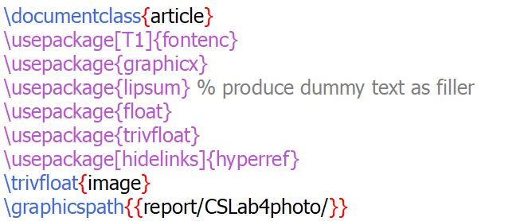

---
## Front matter
lang: ru-RU
title: Лабораторная работа 4
author: Супонина Анастасия Павловна 
institute: РУДН, Москва, Россия

date: 25 октября 2025

## Formatting
## i18n babel
babel-lang: russian
babel-otherlangs: english

## Formatting pdf
toc: false
toc-title: Содержание
slide_level: 2
aspectratio: 169
section-titles: true
theme: metropolis
header-includes:
 - \metroset{progressbar=frametitle,sectionpage=progressbar,numbering=fraction}
---

# Лабораторная работа 4

## Пакеты и функции для работы с картинками и ссылками

{#fig:001 width=50%}

## Вставка изображения

Изображение обозначаем функцией **includegraphics**.

{#fig:002 width=50%}

## Увеличение ширины и высоты

{#fig:003 width=50%}

\! Чтобы избежать искажения исходного изображения второй параметр будет подстраиваться программой автоматически.

## Поворот и масштабирование изображения

{#fig:004 width=50%}

## Обрезка изображения

**clip** - отсекает часть рисунка

**trim** - задает границы

{#fig:005 width=50%}

## Добавление изображения внутрь текста

Параметры расположения в тексте:

• **h** - ‘Здесь’ (если возможно)

• **b** - в верхней части страницы

• **t** - в нижней части страницы

• **p** - на специальной странице, предназначенной только для поплавков

{#fig:006 width=50%}

{#fig:007 width=50%}

## Ссылки и гиперссылки

Для того, чтобы создавать обычные ссылки в latex существует встроенная функция.

{#fig:008 width=50%}

Для гиперссылок нужен специальный пакет.

{#fig:009 width=50%}

## Выводы

В процессе выполнения данной лабораторной работы я научилась добавлять и редактировать графические изображения в среде LaTex, а также создавать ссылки и гиперссылки при работе с документом. 

## {.standout}

Спасибо за внимание!
