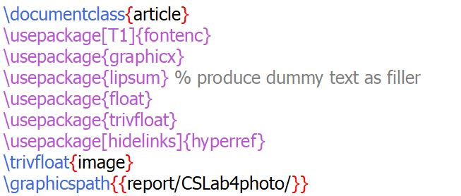
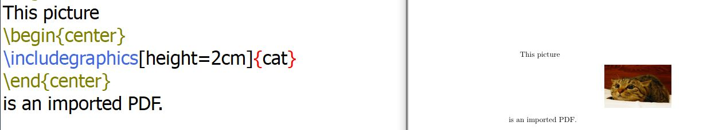
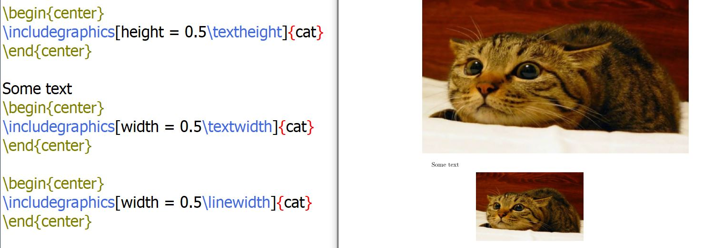
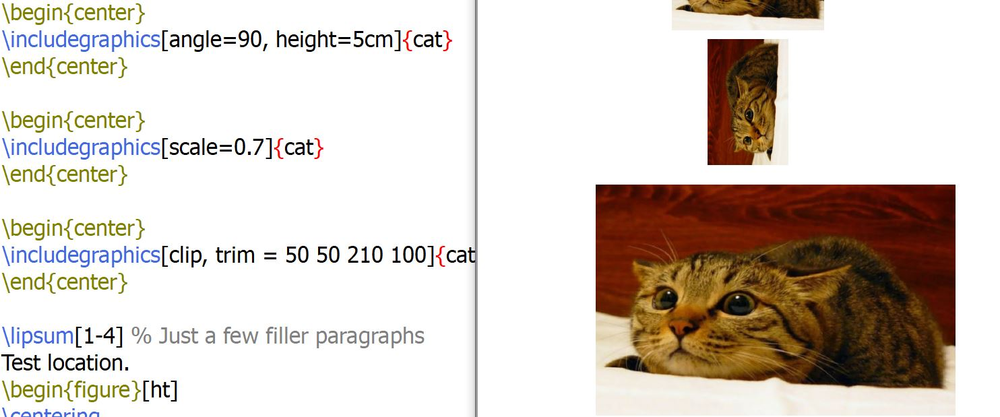
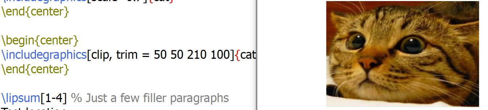
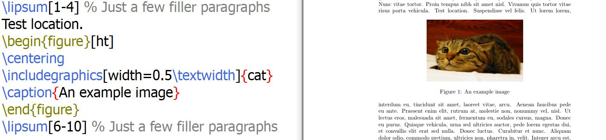
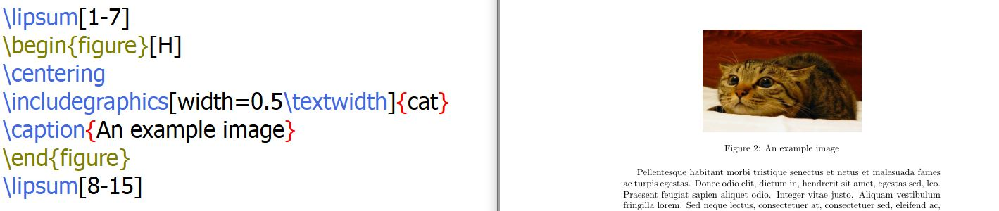
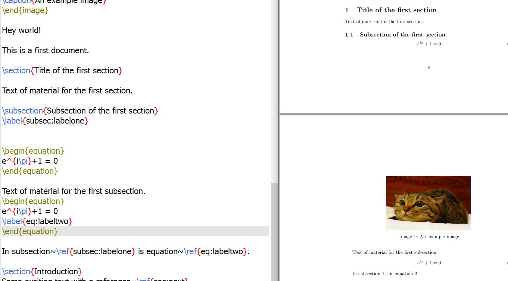
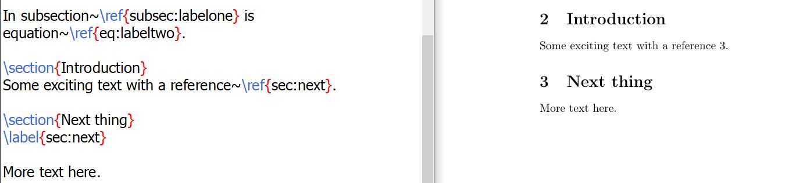

---
## Front matter
title: "Отчёт по лабораторной работе 4"
author: "Супонина Анастасия Павловна"

## Generic otions
lang: ru-RU
toc-title: "Содержание"

## Bibliography
bibliography: cite.bib
csl: pandoc/csl/gost-r-7-0-5-2008-numeric.csl

## Pdf output format
toc: true # Table of contents
toc-depth: 2
lof: true # List of figures
lot: true # List of tables
fontsize: 12pt
linestretch: 1.5
papersize: a4
documentclass: scrreprt
## I18n polyglossia
polyglossia-lang:
  name: russian
  options:
  - spelling=modern
  - babelshorthands=true
polyglossia-otherlangs:
  name: english
## I18n babel
babel-lang: russian
babel-otherlangs: english
## Fonts
mainfont: IBM Plex Serif
romanfont: IBM Plex Serif
sansfont: IBM Plex Sans
monofont: IBM Plex Mono
mathfont: STIX Two Math
mainfontoptions: Ligatures=Common,Ligatures=TeX,Scale=0.94
romanfontoptions: Ligatures=Common,Ligatures=TeX,Scale=0.94
sansfontoptions: Ligatures=Common,Ligatures=TeX,Scale=MatchLowercase,Scale=0.94
monofontoptions: Scale=MatchLowercase,Scale=0.94,FakeStretch=0.9
mathfontoptions:
## Biblatex
biblatex: true
biblio-style: "gost-numeric"
biblatexoptions:
  - parentracker=true
  - backend=biber
  - hyperref=auto
  - language=auto
  - autolang=other*
  - citestyle=gost-numeric
## Pandoc-crossref LaTeX customization
figureTitle: "Рис."
tableTitle: "Таблица"
listingTitle: "Листинг"
lofTitle: "Список иллюстраций"
lotTitle: "Список таблиц"
lolTitle: "Листинги"
## Misc options
indent: true
header-includes:
  - \usepackage{indentfirst}
  - \usepackage{float} # keep figures where there are in the text
  - \floatplacement{figure}{H} # keep figures where there are in the text
---

# Цель работы

Изучить графические возможности LaTex.

# Задание

Изучить возможность добавления изображений и ссылок в документ.

# Выполнение лабораторной работы

## Пакеты и функции для работы с картинками и ссылками

Для того, чтобы работать с изображения необходимо использовать пакет **graphicx**.

В свою очередь в данной работе представлен способ добавления изображения внутрь текста и поэтому введена дополнительный пакет, который создает произвольные абзацы **lipsum**.

В свою очередь пакеты **float** и **trivfloat** позволяют нам работать с плавающими объектами.

А пакет **\[hidelinks\]\{hyperref\}** делает возможным создание гиперссылок.

При работе с большим количеством изображений, когда обычно они все собираются в одну папку используется **graphicspath**, который указывает путь по которому программа будет искать изображения.

{#fig:002 width=50%}

## Вставка изображения

Как только мы добавляем пакет **graphicx** мы можем вставлять в документ изображение, при помощи записи указанной на фото ниже, важно заметить, что название изображения в данном примере написано без разрешения, но можно его записать, хотя программа и так его может определить, что прекрасно видно на примере.

Важно заметить, что для того, чтобы изображение находилось по центу мы прописываем это в begin и end.

А само изображение обозначаем функцией **includegraphics**.

{#fig:002 width=50%}

## Способы редактирования изображения

Но работая с изображениями зачастую нам нужно изменять их форму или размер, для этого существует различные функции, которые представлены ниже.

### Увеличение ширины и высоты

Данная функция, я думаю, достаточно понятна по принципу работы, но есть важный момент, когда вы будете увеличивать или уменьшать один из этих параметров вашего изображения, для того, чтобы избежать искажения исходного изображения второй параметр будет подстраиваться программой автоматически.

{#fig:002 width=50%}

### Поворот и масштабирование изображения

Для поворота изображения используется параметр **angle** со значение угла на который вы его хотите повернуть.

Параметр **scale**, в свои очередь, используется для того, чтобы настроить масштаб исходного изображения.

{#fig:002 width=50%}

### Обрезка изображения

Параметры **clip** и **trim** позволяют нам обрезать наше исходное изображение. В данной комбинации **clip** имеющий по умолчанию значение true, обозначает отсекает часть рисунка, а **trim** задает расстояния между левыми, нижними, правыми и верхними границами. Соответсвенно изменяя эти параметры мы можем получить ту часть изображения, которая нам нужна.

{#fig:002 width=50%}

## Добавление изображения внутрь текста

При добавлении изображение если несколько параметров, которые указаны ниже с их описанием, так же из можно комбинировать, как показано на примере ниже.

Важно, что в таком случае у begin и end мы должны в фигурных скобках написать figure.

При таком добавлении, как в предыдущей лабораторной работе связанной с уравнениями изображения будут нумероваться, что в дальнейшем дает возможность на них удобно ссылаться в документе. Нумерация происходит автоматически.

• **h** - ‘Здесь’ (если возможно)

• **b** - в верхней части страницы

• **t** - в нижней части страницы

• **p** - на специальной странице, предназначенной только для поплавков

{#fig:002 width=50%}

На втором примере параметр H - это строгий параметр и зачастую лучше избегать его использования, так как это может плохо повлиять на структуру документа, например останеться много пустого места.

{#fig:002 width=50%}

## Ссылки и гиперссылки

Для того, чтобы создавать обычные ссылки в latex существует встроенная функция, объект для будущей ссылки необходимо отмечать используя **label**, а для того, чтобы уже вставить эту ссылку используется **ref**, это представлено на изображении ниже.

{#fig:002 width=50%}

Однако, если вы хотите вставить гиперссылку, которая при нажатии, будет отправлять вас к выбранному элементу, то сам способ точно такой же, но необходимо добавить специальный пакет для гиперссылок, который был указан в самом начале.

{#fig:002 width=50%}

# Выводы

В процессе выполнения данной лабораторной работы я научилась добавлять и редактировать графические изображения в среде LaTex, а также создавать ссылки и гиперссылки при работе с документом. 

# Список литературы{.unnumbered}

::: Пособие по лабораторным работам [posobie]
