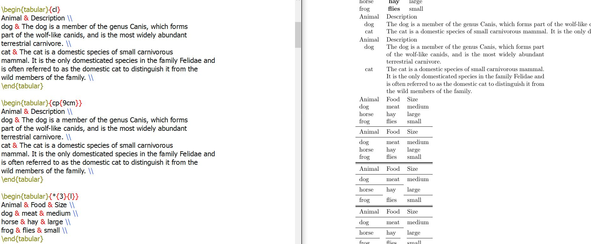
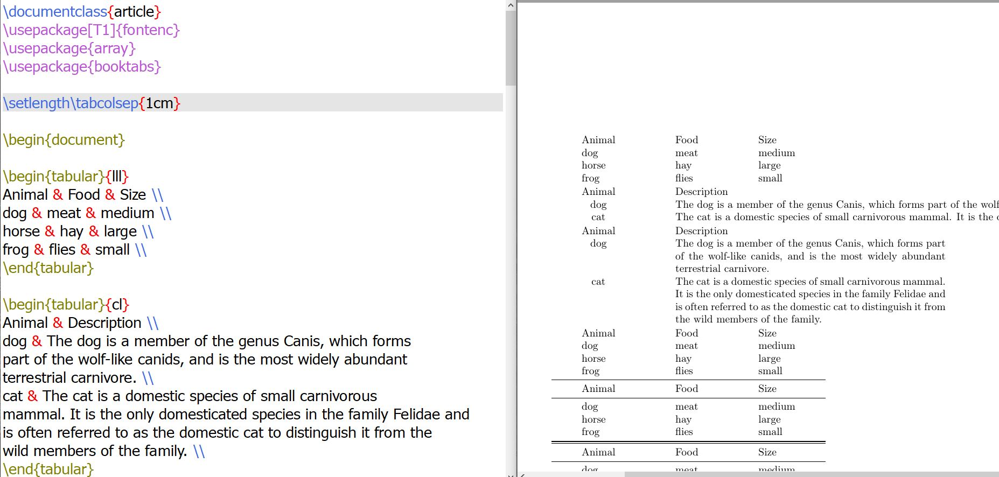
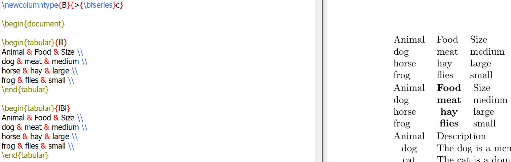
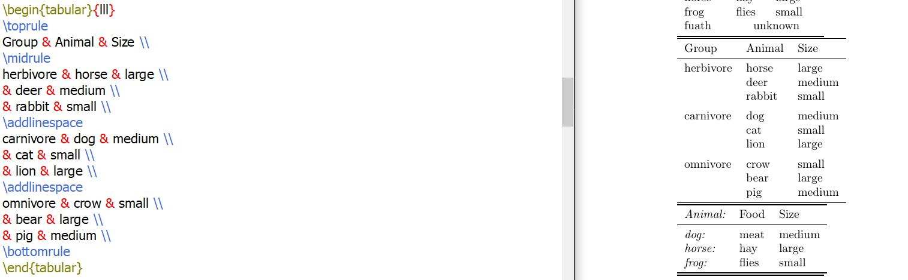
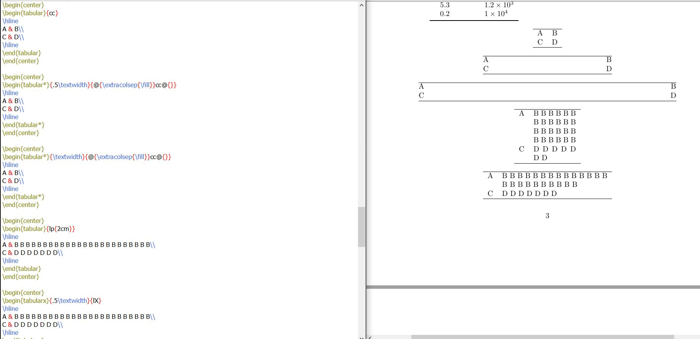
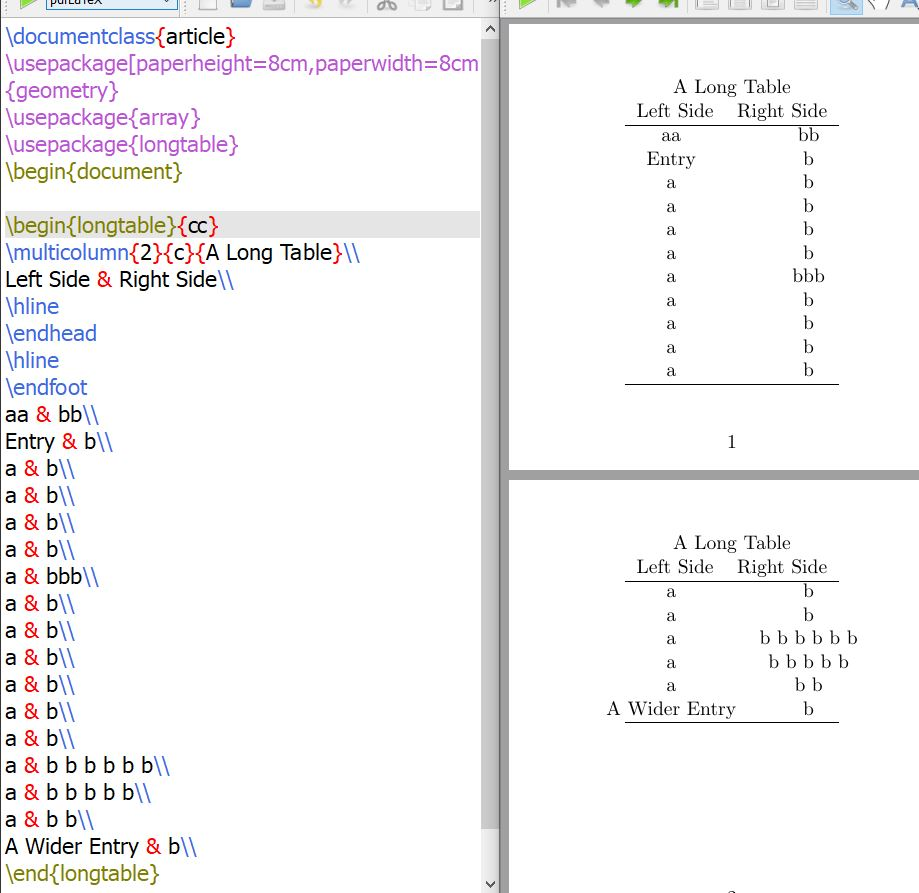

---
## Front matter
lang: ru-RU
title: Лабораторная работа 5
author: Супонина Анастасия Павловна 
institute: РУДН, Москва, Россия

date: 8 ноября 2025

## Formatting
## i18n babel
babel-lang: russian
babel-otherlangs: english

## Formatting pdf
toc: false
toc-title: Содержание
slide_level: 2
aspectratio: 169
section-titles: true
theme: metropolis
header-includes:
 - \metroset{progressbar=frametitle,sectionpage=progressbar,numbering=fraction}
---

# Лабораторная работа 4

## Необходимые пакеты

**array** — основной пакет, позволяет записывать таблица, а также расширяет возможности окружений таблиц, позволяя определять новые типы столбцов.

**booktabs** — предоставляет команды для оформления таблиц с горизонтальными линиями и правильными отступами.

**suinitx** — пакет для записи математических выражений в таблице.

**tabularx** — создаёт таблицы с автоматическим вычислением ширины столбцов, чтобы таблица вписывалась в заданную общую ширину.

**threeparttable** — позволяет добавлять примечания к таблицам, которые правильно выравниваются по ширине самой таблицы, а не всего текстового блока.

**ragged2e** — улучшает выравнивание текста, предоставляя команды для выравнивания влево/вправо и по центру с переносами слов и микроподгонкой.

## Запись таблиц и ширина записи

{#fig:002 width=50%}

## Расстояние между строк

{#fig:002 width=50%}

## Жирный шрифт

Мы можем создать новый тип колонки и присвоить ему свойство **bfseries** и далее использовать созданный параметр.

{#fig:002 width=50%}

## Объединение ячеек в строке и изменение формата записи

**multicolumn** - принимает три аргумента: 
1. Количество ячеек, которые должны быть объединены 
2. Выравнивание объединенной ячейки 
3. Содержимое объединенной ячейки 

{#fig:002 width=50%}

## Объединение столбцов

В LaTex не предусмотрены функции для объединения столбцов.

{#fig:002 width=50%}

## Запись курсивом и дополнительные знаки

Поскольку \> и < могут использоваться для размещения вещей перед и после содержимого ячейки столбца, вы можете использовать их для добавления команд, которые влияют на внешний вид столбца. 

{#fig:002 width=50%}

## Добавление расстояния между столбцами

Пространство между стоблцами можно заменить на что-то произвольное, используя @. Токен \! делает что-то довольно похожее.
А | в свою очередь похоже на \!\{decl\}.

{#fig:002 width=50%}

## Изменение толщины границ

{#fig:002 width=50%}

## Таблицы с численными значниями

Необходимо ввести пакет siunitx.

{#fig:002 width=50%}

## tabular и tabularx

**Tabular** — базовое окружение, которое позволяет определить структуру таблицы, указав количество столбцов и их форматирование.  

**Tabularx** — расширение стандартной таблицы tabular с автоматическим расчётом ширины колонок. У таблицы можно указать общую ширину (первый параметр). Автоматически вычисляемая колонка обозначается как X. Текст в таких колонках автоматически переносится. 

## tabular и tabularx

{#fig:002 width=50%}

## Многостраничные таблицы

Для их записи необходимо ввести пакет **longtable**.

{#fig:002 width=50%}

## Ссылки в таблице

Для их записи необходимо ввести пакет **threeparttable**. Сам формат записи можно видеть на изображении ниже.

{#fig:002 width=50%}

## Вёрстка в узких колонках

Настройки разбиения строк по умолчанию предполагают относительно длинные строки, чтобы обеспечить некоторую гибкость в выборе разбиений строк. Следующий пример показывает некоторые возможные подходы. Первая таблица показывает растянутое межсловное пространство, и TeX предупреждает о недостаточно полных строках. Использование **raggedright** обычно избегает этой проблемы, но может оставить некоторые строки «слишком рваными». Команда **RaggedRight** из пакета **ragged2e** является компромиссом; она допускает некоторую рваность в длине строк, но также будет переносить слова, где это необходимо, как показано в третьей таблице. Обратите внимание на использование **arraybackslash** здесь, которое сбрасывает определение \\ так, чтобы оно завершало строку таблицы. Альтернативная техника, как показано в четвертой таблице, заключается в использовании меньшего шрифта, чтобы колонки не были такими узкими относительно размера текста.

## Вёрстка в узких колонках

{#fig:002 width=50%}

## Вертикальные трюки

{#fig:002 width=50%}

## Изменение межстрочного интервала

{#fig:002 width=50%}

## Выводы

В процессе выполнения данной лабораторной работы я научилась добавлять и редактировать таблицы в среде LaTex. 

## {.standout}

Спасибо за внимание!