---
## Front matter
title: "Отчёт по лабораторной работе 5"
author: "Супонина Анастасия Павловна"

## Generic otions
lang: ru-RU
toc-title: "Содержание"

## Bibliography
bibliography: cite.bib
csl: pandoc/csl/gost-r-7-0-5-2008-numeric.csl

## Pdf output format
toc: true # Table of contents
toc-depth: 2
lof: true # List of figures
lot: true # List of tables
fontsize: 12pt
linestretch: 1.5
papersize: a4
documentclass: scrreprt
## I18n polyglossia
polyglossia-lang:
  name: russian
  options:
  - spelling=modern
  - babelshorthands=true
polyglossia-otherlangs:
  name: english
## I18n babel
babel-lang: russian
babel-otherlangs: english
## Fonts
mainfont: IBM Plex Serif
romanfont: IBM Plex Serif
sansfont: IBM Plex Sans
monofont: IBM Plex Mono
mathfont: STIX Two Math
mainfontoptions: Ligatures=Common,Ligatures=TeX,Scale=0.94
romanfontoptions: Ligatures=Common,Ligatures=TeX,Scale=0.94
sansfontoptions: Ligatures=Common,Ligatures=TeX,Scale=MatchLowercase,Scale=0.94
monofontoptions: Scale=MatchLowercase,Scale=0.94,FakeStretch=0.9
mathfontoptions:
## Biblatex
biblatex: true
biblio-style: "gost-numeric"
biblatexoptions:
  - parentracker=true
  - backend=biber
  - hyperref=auto
  - language=auto
  - autolang=other*
  - citestyle=gost-numeric
## Pandoc-crossref LaTeX customization
figureTitle: "Рис."
tableTitle: "Таблица"
listingTitle: "Листинг"
lofTitle: "Список иллюстраций"
lotTitle: "Список таблиц"
lolTitle: "Листинги"
## Misc options
indent: true
header-includes:
  - \usepackage{indentfirst}
  - \usepackage{float} # keep figures where there are in the text
  - \floatplacement{figure}{H} # keep figures where there are in the text
---

# Цель работы

Изучить таблицы LaTex.

# Задание

Изучить возможность создания таблиц.

# Выполнение лабораторной работы

## Необходимые пакеты

Перечень пакетов, при работе с таблицами в LaTex: 

**array** — основной пакет, позволяет записывать таблица, а также расширяет возможности окружений таблиц, позволяя определять новые типы столбцов.

**booktabs** — предоставляет команды для оформления таблиц с горизонтальными линиями и правильными отступами.

**suinitx** — пакет для записи математических выражений в таблице.

**tabularx** — создаёт таблицы с автоматическим вычислением ширины столбцов, чтобы таблица вписывалась в заданную общую ширину.

**threeparttable** — позволяет добавлять примечания к таблицам, которые правильно выравниваются по ширине самой таблицы, а не всего текстового блока.

**ragged2e** — улучшает выравнивание текста, предоставляя команды для выравнивания влево/вправо и по центру с переносами слов и микроподгонкой.

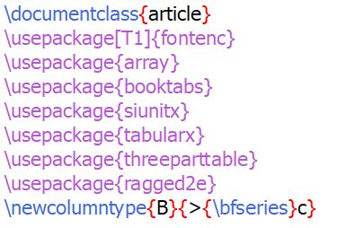{#fig:002 width=50%}

## Запись таблиц и ширина записи

Для записи таблицы используем begin и end со словом tabular, как видно на изображении ниже. В данном примере в первый раз текст полностью не помеается, поэтому добавляем параметр **p** со значением **9cm**, который ограничит зону записи текста таблицы, так как по умолчанию она не ограничивается.

Тут используются следующие параметры, благодаря, которым получаем желаемый вид таблицы.

c - centered column
l - left aligned column
p{width} - a column with fixed width width; the text will be
automatically line wrapped and fully justified

{#fig:002 width=50%}

Когда мы пишем таблицу мы указываем формат для каждого столбца, то есть если из 3, мы должны для выравнивания их всех по левому краю записать lll, но на изображении выше указана более комфортная форма записи, которая будет ещё полезнее, если столбцов в таблице будет намного больше.

## Расстояние между строк

В Latex, расстояние между строками и столбцами в таблице задается по умолчанию, но его можно изменить, один из способов показан на изображении ниже. Тут при помощи **tabcolsep** мы задаем расстояние равное 1 сантиметру, важно, что такая настройка будет влиять на все таблицы в документе, что иногда может быть не очень удобно, как это сделать отдельно для таблицы, рассмотрим чуть позже.

{#fig:002 width=50%}

## Жирный шрифт

Часто в документе нам нужно что-то выделить жирным шрифтом, тоже касается и таблиц, и чтобы это было сделать просто, мы можем создать новый тип колонки (в нашем случае B) и присвоить ему свойство **bfseries**, тогда при использовании B, как параметр столбца, текст в нём будет выделяться жирным шрифтом, как показано на изображении ниже.

{#fig:002 width=50%}

## Объединение ячеек в строке и изменение формата записи

**multicolumn** - принимает три аргумента: 
1. Количество ячеек, которые должны быть объединены 
2. Выравнивание объединенной ячейки 
3. Содержимое объединенной ячейки 

При этом если значение первого аргумента записать равным 1, то его можно использовать для изменения выравния в отдельной ячейке, относительно других.

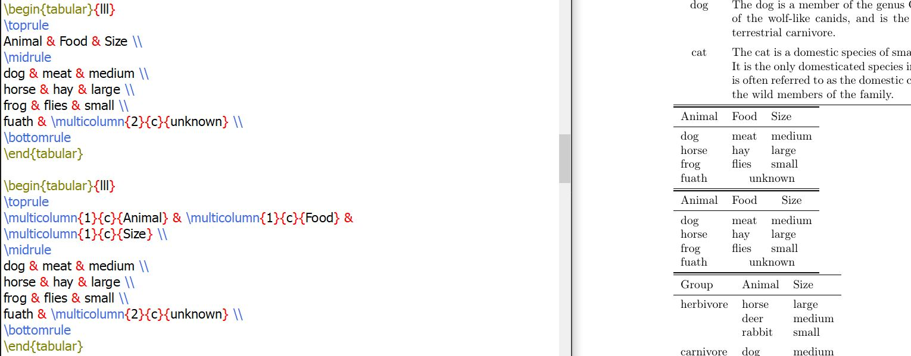{#fig:002 width=50%}

## Объединение столбцов

В LaTex не предусмотрены функции для объединения столбцов, но это можно обойти используя форму записи указанную на изображении ниже.

{#fig:002 width=50%}

## Запись курсивом и дополнительные знаки

Поскольку \> и < могут использоваться для размещения вещей перед и после содержимого ячейки столбца, вы можете использовать их для добавления команд, которые влияют на внешний вид столбца. 

В данном примере используем стиль **itshape**, чтобы текст записывался курсивом, а также добавляет в фигурных скобках : и таким образом получаем следующую запись таблицы на рисунке ниже.

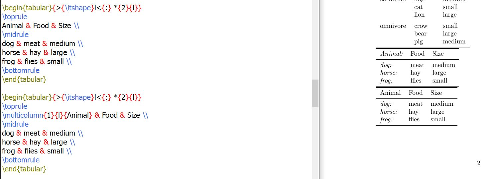{#fig:002 width=50%}

## Добавление расстояния между столбцами

Пространство между стоблцами можно заменить на что-то произвольное, используя @. Это уберет отступ между двумя столбцами или с любого конца и вместо этого поместит что-либо между столбцами, которые вы укажете в качестве аргумента.

Чтобы добавить расстояние между столбцами в первом примере используется **hspace**.

Токен \! делает что-то довольно похожее. Разница в том, что он добавляет свой аргумент в центр пространства между двумя столбцами во втором примере.

А | в свою очередь похоже на \!\{decl\}; оно добавляет вертикальное правило между двумя столбцами, оставляя отступы как есть. Однако есть огромный недостаток; вертикальные правила не работают с горизонтальными правилами, предоставляемыми booktabs.

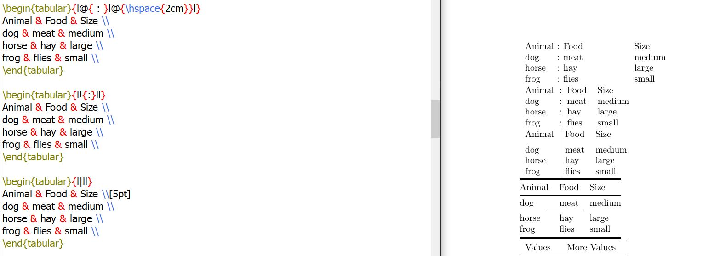{#fig:002 width=50%}

## Изменение толщины границ

Производиться с помщью функций указанных на иображении ниже.

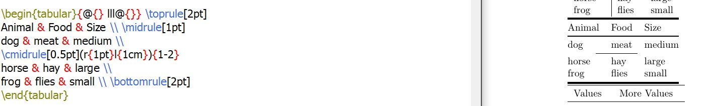{#fig:002 width=50%}

## Таблицы с численными значниями

Для того, чтобы записывать таблицу с численными значениями необходими ввести пакет siunitx, и в параметрах таблицы прописать правило S. *Однако, если вы хотите в такой таблице записывать текст, то его необходимо писать в фигурных скобках.*

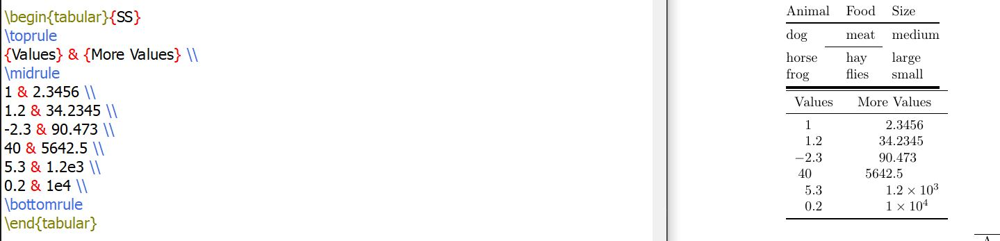{#fig:002 width=50%}

## tabular и tabularx

**Tabular** — базовое окружение, которое позволяет определить структуру таблицы, указав количество столбцов и их форматирование.  

**Tabularx** — расширение стандартной таблицы tabular с автоматическим расчётом ширины колонок. У таблицы можно указать общую ширину (первый параметр). Автоматически вычисляемая колонка обозначается как X. Текст в таких колонках автоматически переносится. 

{#fig:002 width=50%}

## Многостраничные таблицы

Для их записи необходимо ввести пакет **longtable**, формат записи указан на изображении ниже, в большей степени он похож на запись стандартной таблицы, но тут название и первая основная строка выделяются для того, чтобы потом дублироваться на следующи страница документа.

{#fig:002 width=50%}

## Ссылки в таблице

Для их записи необходимо ввести пакет **threeparttable**. Сам формат записи можно видеть на изображении ниже.

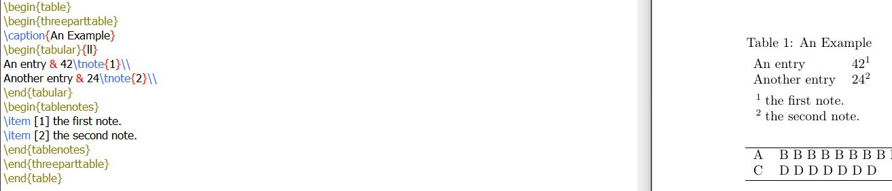{#fig:002 width=50%}

## Вёрстка в узких колонках

Настройки разбиения строк по умолчанию предполагают относительно длинные строки, чтобы обеспечить некоторую гибкость в выборе разбиений строк. Следующий пример показывает некоторые возможные подходы. Первая таблица показывает растянутое межсловное пространство, и TeX предупреждает о недостаточно полных строках. Использование **raggedright** обычно избегает этой проблемы, но может оставить некоторые строки «слишком рваными». Команда **RaggedRight** из пакета **ragged2e** является компромиссом; она допускает некоторую рваность в длине строк, но также будет переносить слова, где это необходимо, как показано в третьей таблице. Обратите внимание на использование **arraybackslash** здесь, которое сбрасывает определение \\ так, чтобы оно завершало строку таблицы. Альтернативная техника, как показано в четвертой таблице, заключается в использовании меньшего шрифта, чтобы колонки не были такими узкими относительно размера текста.

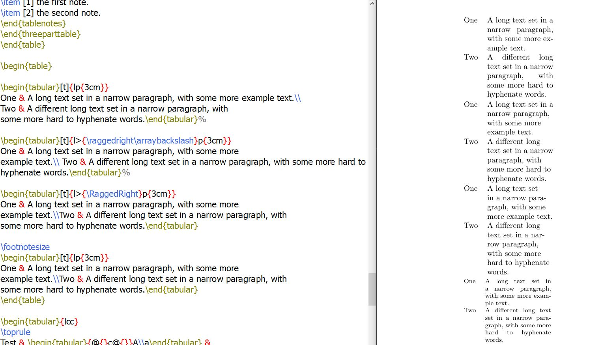{#fig:002 width=50%}

## Вертикальные трюки

Часто, вместо того чтобы сделать ячейку, охватывающую несколько строк, лучше иметь одну строку, в которой некоторые ячейки разделены вертикально с помощью вложенных табличных окружений. То есть по сути легче просто создать таблицу внутри таблицы, как на изображении ниже

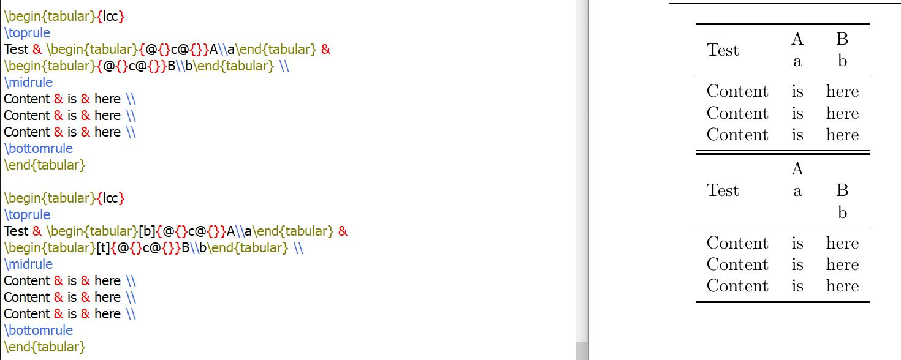{#fig:002 width=50%}

## Изменение межстрочного интервала

Существуют два общих параметра, которые контролируют межстрочный интервал **arraystretch** - увеличивает базовое расстояние на 50%, мы рассматривали его ранее. В свою очередь параметр **extrarowheight** позволить нам изменить его для определенной таблицы, как на изображении ниже.

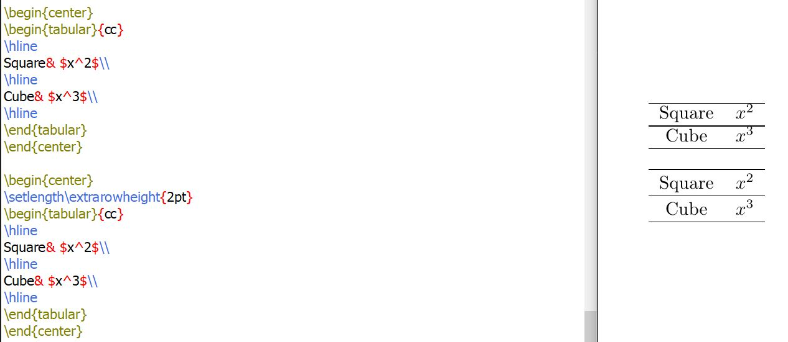{#fig:002 width=50%}

## Задача

Используйте простой пример таблицы, чтобы начать экспериментировать с таблицами.
1. Попробуйте разные выравнивания, используя типы столбцов l , c и r .
2. Что происходит, если в строке таблицы слишком мало элементов?
3. А если слишком много?
4. Экспериментируйте с командой \multicolumn для объединения столбцов.

Если количество элементов будет меньше, то один столбец, прочто останется пустым.

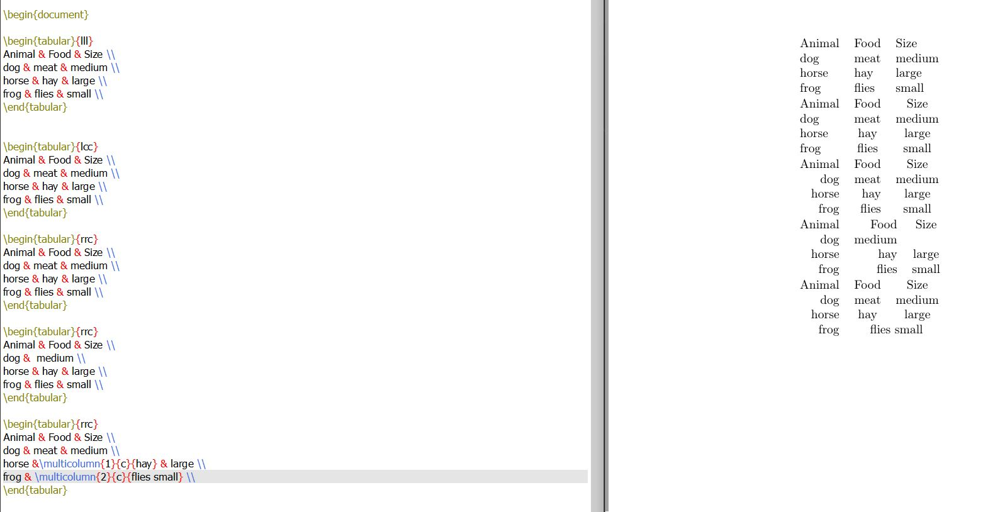{#fig:002 width=50%}

Касаемо пункта 3, LaTex выдаст следующую ошибку.

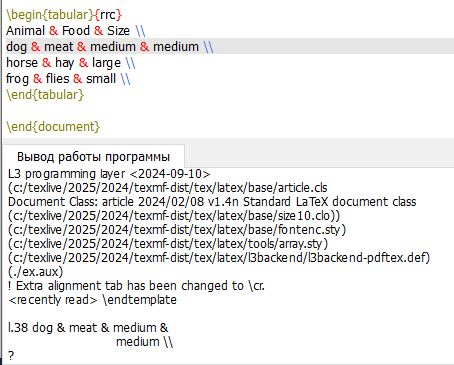{#fig:002 width=50%}

# Выводы

В процессе выполнения данной лабораторной работы я научилась добавлять и редактировать таблицы в среде LaTex. 

# Список литературы{.unnumbered}

::: Пособие по лабораторным работам [posobie]
